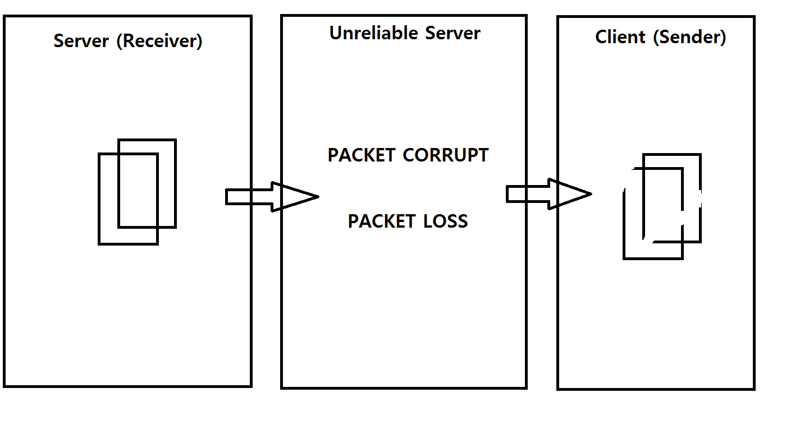
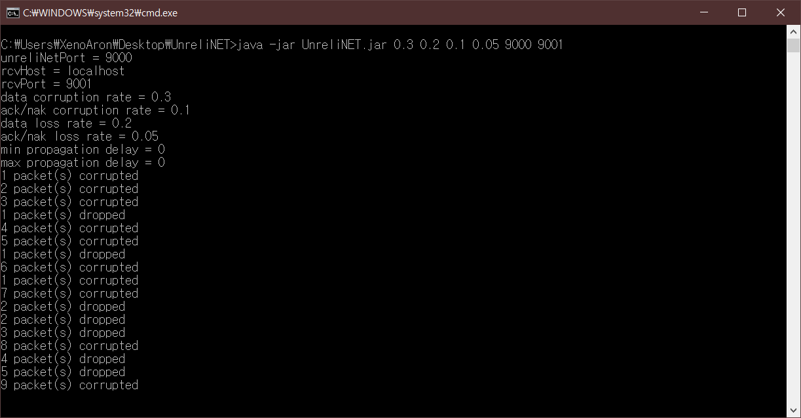
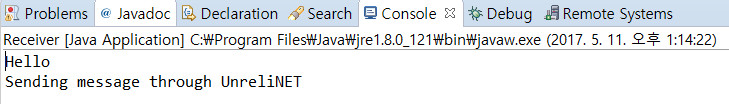
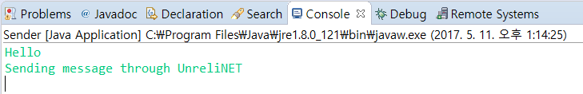

# 2011161080-SongJuHyung
UDP를 이용한 파일 전송 프로그램  
전체적인 프로그램의 구조는 
-------------
Server - Unrelitive Server - Client로 구성되며
> - Server는 파일을 받는 역할
> - Client는 파일을 보내는 역할 
> - Unrelitive Server는 고의적으로 패킷을 손상 및 손실을 일으키는 서버를 두어서 시뮬레이팅 하는 역할  
  
> - Sender에서 메세지를 보내면 UnreliNET 에서 보실 수 있는것과 같이 UnreliNE T을 실행할때 설정해둔 확률로 패킷이 손상(corrupted) 또는 손실(dropped)을 시킵니다.
> - 하지만 Receiver에서 보시는 것과 같이 패킷이 손상되어도 ACK, checksum, sequence를 통해 재전송 요청으로 정상도착할 수 있도록 구성하였습니다.  

<<전체적인 Sender 와 Receiver의 절차>>
-------------------------------------
1. Sender에서 메세지 입력.
2. Sender에서 메세지를 패킷화 (checksum + sequence + message) 시켜서 Receiver로 보냄. 패킷의 각 값들은 ";" 로 구분지어줌.
3.  Receiver에서 패킷을 받음.
4. 패킷을 분석하여 {checksum, sequence, message}로 분할해냄. 이 때, 패킷이 손상되어 각 값들을 구분하는 ";"가 패킷에서 찾을 수 없을 경우 손상으로 간주.
5. 정상적으로 분할했을 경우 checksum과 받은 message의 checksum을 구한 값을 비교하여 손상된 패킷인지 확인합니다.
6. 패킷을 받으며 카운팅하고 있던 sequence와 현재 받은 패킷의 sequence를 비교하여 올바른 순서인지 확인합니다.
7. 위 모든 조건을 통과했을 경우 손상되거나 손실된 패킷이 아닌것으로 간주하여 출력합니다.  

<< Sender 에서의 처리 과정>>
---------------------------
> - seq = 0
> - 1. message 입력
> - 2. new Packet(sendseq++, checksum, message)
> - 3. Sender -> (Packet) -> Receiver
> - 4. Receive 대기
> - 5. ACK 받음
> - 6. ACK 확인 (ack.seq == this.seq)
	true.seq++;
	false. return to "3"

<< Receiver 에서의 처리 과정>>
----------------------------
> - seq = 0
> - 1. receive packet
> - 2. packet에서 seq, checksum, message 구함  

     2-1. exception(corrupted)
		send (seq-1)
> - 3. Packet확인 (packet.seq == this.seq)
	true. send (seq)
	false. send (seq-1)
  
  
  <<프로그램 실행 절차>>
---------------------------
 1. UnreliNET을 킵니다.
 >- javac UnreliNET.java 
 >- java UnrelieNET 0.3 0.2 0.1 0.05 9000 9001  
 
 ("Usage: java UnreliNET <P_DATA_CORRUPT> <P_DATA_LOSS> <P_ACK_CORRUPT> <P_ACK_LOSS> 포트번호 포트번호") 
 ("훼손율[CORRUPT] , 손실율[LOSS]은 임의값으로 변경하여도 무관")
 
   
 
 
 
 2. Receiver를 켭니다. (;SERVER)
 >- javac receiver.java  
 >- java receiver  
  
 
 3. Sender을 킵니다. (;Client) 
 >- javac sender.java 
 >- java sender  
 
 
 4. Sender측의 cmd창에서 아무문자열입력 후 엔터 (최대: 1024byte) 
 
 5. UnreliNet에서  확률에 따라 오류 미발생이면 그대로 전송 되지만 
  >- 전송 중에 오류(손상 또는 손실) 발생 시 corrupt(훼손)되었는지 drop(손실) 되었다고 메세지 출력 후 재전송  
  >- 재전송 될때 마다 값을 누적해 출력 하고, ACK를 보내는 중에 똑같이 오류시 (손상 또는 손실) 메세지를 출력합니다.
 
 
 
